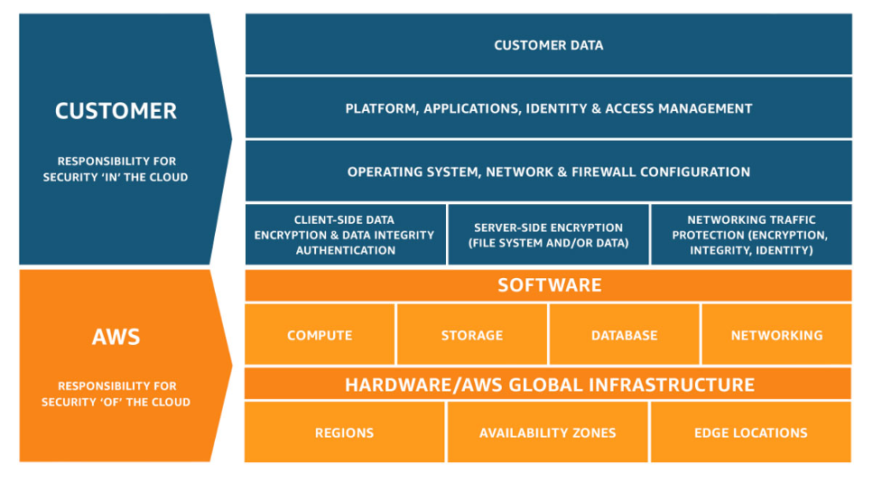

## Shared Responsiblity Model

This is the model which says who is responsible for what. 

- aws - Responsiblity OF the cloud
- customer - Responsiblity IN the cloud

Simply put aws takes care of the data center that offers the actual aws services and the customer should be taking care of proper configurations of the aws services that they run.
